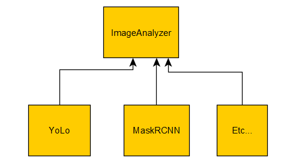

# Backend server

## Motivation

This **server** shall receive a picture representation as a form of matrix, apply analysis tools to extract meta-information, and give an answer back to the frontend.

## Development methodology
This **must** use Test Driven Development, so any logic code cannot be written unless it is to make a failing test code pass.
Why? So we ensure a 100% test coverage.

## Key points

### Picture representation

Abstractly, we can define a picture as being a tensor of **[cols, rows, num_chans]**. A black and white picture is thus a [cols, rows] matrix, for which each element of the matrix is a greyscale value. A RGB image shall be [cols, rows, 3], for each color channel. RGB is not the only model of matrix of depth 3 we have, we can have for instance the HSV color space (for Hue, Saturation, Value).

A picture shall then always be accompanied with a colorspace, otherwise its interpretation would be wrong. A picture is then represented with:

(size, colorspace, data)

### Image Analysis Strategy

We want to define a ImageAnalyser class, that shall have a process method. This processing method shall take a (size, colorspace, data) as parameters, and which shall output a list of Information.

A suggestion for the information class can be:

For each element in our Image (i.e. pixels), we shall associate a list of Information.

Information {

    name,
    type,
    value,
    comment
    
}

For instance for the object category

ObjectCategoryInformation
